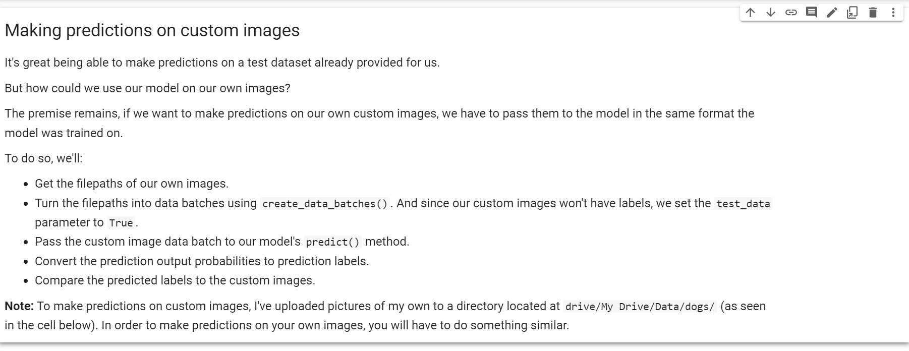
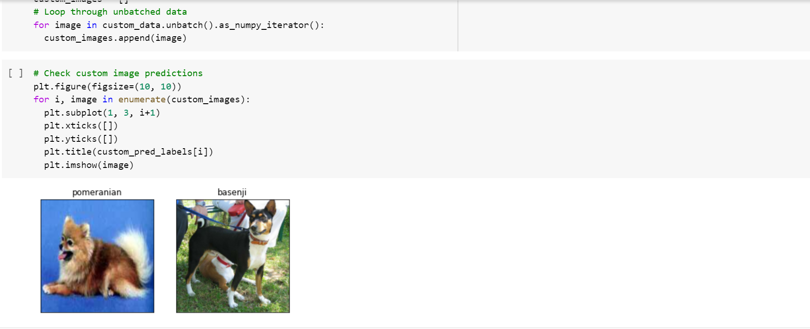

# Dog-Identifier
This Machine can identify your Dog

process for Demonstration

1 . Download all the project files 

2 . Unzip 

3 . Go to Kaggle Website search for dog-breed identification data

4 . download that data (this data contains 10000+ images of different dog breeds

5 . upload this data to google drive

6 . open goolge colaboratory 

7 . Give access of your drive account to Colaboratory

8 . then open notebook that you've downloaded from my code here through colab

9 . start GPU 

10. Run all the cells

Some Images form Colab

  Here you can see that by providing random images to model it is able to predict their names

